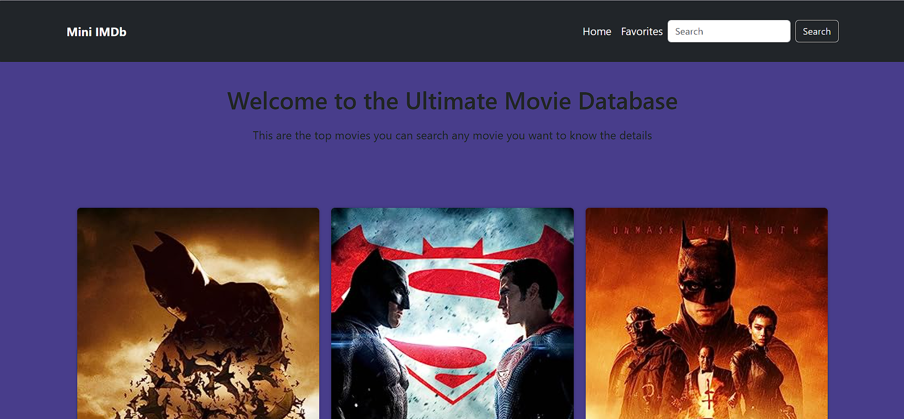

# Mini IMDB Clone App

## Table of Contents

- [Introduction](#introduction)
- [Features](#features)
  - [Home Page](#home-page)
  - [Movie Page](#movie-page)
  - [My Favorite Movies Page](#my-favorite-movies-page)
- [Technologies Used](#technologies-used)
- [Getting Started](#getting-started)
- [How to Use](#how-to-use)
- [Demo](#Demo)
- [Contributors](#contributors)

## Introduction

Welcome to the Mini IMDb Clone! This web application allows users to explore movies, view movie details, and manage a list of favorite movies. With a clean and user-friendly interface, the app lets you search for movies using keywords and interact with their details.

## Features

### Home Page

- **Search:** Use the search bar to find movies by entering keywords. The app provides real-time suggestions as you type, similar to Google's autocomplete feature.
- **Search Results:** The search results are displayed as interactive cards, featuring the movie's title, release year, and poster. Each card provides options to view movie details or add the movie to your favorites.
- **Add to Favorites:** Click the "Add to Favorites" button on a movie card to add it to your list of favorite movies.

### Movie Page

- **Movie Details:** Click on a search result card to access a dedicated movie page with in-depth information about the selected movie.
- **Movie Information:** On the movie page, you'll find essential details such as the movie's title, poster image, release year, IMDb rating, plot summary, director, and main actors.

### My Favorite Movies Page

- **Favorites List:** Navigate to the "My Favorite Movies" page to see a list of all your favorite movies.
- **Persistence:** The list of favorite movies is stored locally in your browser's storage, ensuring it remains intact even when you close or refresh the browser.
- **Remove from Favorites:** Each movie listed on the favorites page has a "Remove from Favorites" button. Clicking this button will remove the movie from your favorites list.

## Technologies Used

- **HTML:** Used for structuring the web pages.
- **CSS:** Styling the web pages to create an appealing user interface.
- **JavaScript:** Implemented core functionalities, handled API requests, and facilitated user interactions.
- **Bootstrap (optional):** Utilized for styling elements and achieving responsive layouts.

## Getting Started

1. **Clone the Repository:** Use the following command to clone this repository:
2. **Navigate to the Project Directory:** Open the terminal and navigate to the project directory:
3. **Open the App:** Open the `index.html` file in your web browser to start using the app.

## How to Use

1. **Search for Movies:** On the home page, type a movie title in the search bar and press Enter.
2. **Explore Search Results:** Browse through the search results. Click on a movie card to see more details on the movie page.
3. **View Movie Details:** On the movie page, you can find detailed information about the selected movie.
4. **Add to Favorites:** Feel free to add movies to your favorites list using the "Add to Favorites" button.
5. **Manage Favorites:** Access the "My Favorite Movies" page from the navigation bar to view and manage your favorite movies. You can also remove movies from your favorites list.

## Demo

- [IMDB_CLONE](https://narendar14082000.github.io/IMDBCLONE/index.html)

## Contributors

- [Paindla Narendar Reddy](https://github.com/akashpadampalle/imdb-clone/tree/main)

